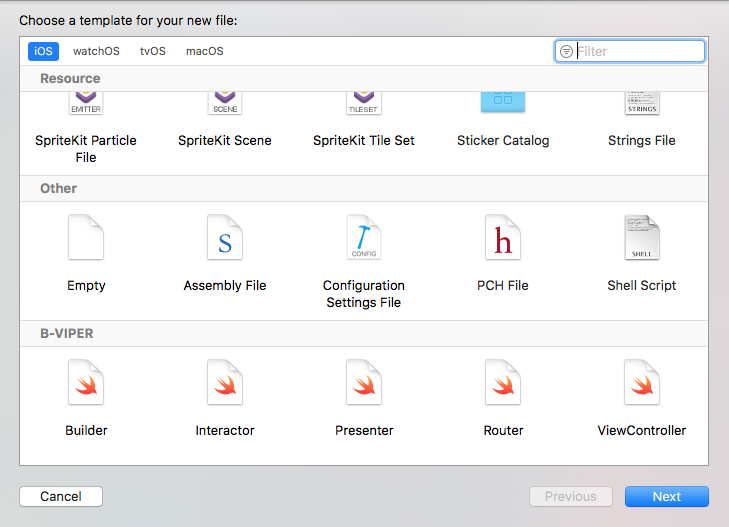

# Xcode-templates
Repository contains Xcode templates for `B-VIPER` classes and protocols.

`B-VIPER` is modification of `VIPER` architecture that adds `Builder` class to create module. You can find more about it [here](https://github.com/nzaghini/b-viper).

## How to use
To use templates copy `B-VIPER` directory to:

```
~/Library/Developer/Xcode/Templates
```

Then start Xcode and when creating new file you should see:



## Example
Example FooPresenter file with all dependencies:

```swift
//
//  FooPresenter.swift
//  FooProject
//
//  Created by Karolina Samorek on 31.05.2017.
//  Copyright © 2017 skarol. All rights reserved.
//

import Foundation
import UIKit

protocol FooPresenter {
      func loadContent()
}

class FooDefaultPresenter {

      fileprivate weak var view: FooView?
      fileprivate let interactor: FooInteractor
      fileprivate let router: FooRouter

      init(view: FooView, interactor: FooInteractor, router: FooRouter) {
          self.view = view
          self.interactor = interactor
          self.router = router
      }
}

extension FooDefaultPresenter: FooPresenter {

      func loadContent() {

      }

}
```
